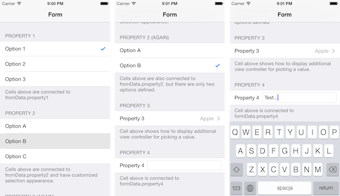

DRForms
=======

iOS Objective-C library for implementing dynamic forms.

Library provides customizable form controller (based on `UITableViewController`) that can be connected to form data model object thanks to KVO. Form fields are represented by table view cells. There are three types of form fields defined out of the box:

- Select
- Detail
- Text

__Select__ fields representing a concrete value of given property. You can treat them like HTML radio buttons. __Detail__ fields representing property and currently set value. Those fields can have custom actions defined (for example, you can show another form for choosing a value). __Text__ fields contains `UITextField` and allows user to type string value for given property.

Each field can be dynamically connected to a property (by specifying observed object and its key path). Once a field is connected to given property it will observe it and update view immediately when property's value changes.

Creating a form is pretty simple, you just need to define form model (can be any object with public properties you would like to set using the form) and implement `DRFormViewContollerDelegate` protocol, that configures field types and their order. Library doesn't provide any UI for the form, you will have to build it using InterfaceBuilder (check out attached demo project for an example). You can customize provided fields by subclassing their classes or even create additional field types if you need.

Library provides nice workaround for setting custom table view cell heights using only InterfaceBuilder, so there is no extra coding required, cell heights on a device will be exactly the same as in InterfaceBuilder.

## Installation

You can install the library using CocoaPods. To do so, you will need to add one of the following lines to your Podfile:

For most recent or development version:

	pod "DRForms", :git => "https://github.com/darrarski/DRForms-iOS"

For specific version:

	pod "DRForms", :git => "https://github.com/darrarski/DRForms-iOS", :branch => "VERSION_BRANCH"

Where `VERSION_BRANCH` you should put the branch name for given version (ex. "v1.x"). It is recommended to set version branch explicity, as backward compatibility between those branches is not warranted. Master branch always contains the most recent version.

## Usage

Public methods of the library are documented in-code. For detailed examples check out attached demo project.

## License

Code in this project is available under the MIT license.

## Credits

[JosephH answer on StackOverflow](http://stackoverflow.com/a/16881312/514181) for setting custom cell height in `UITableView` with dynamic cells, using only InterfaceBuilder
